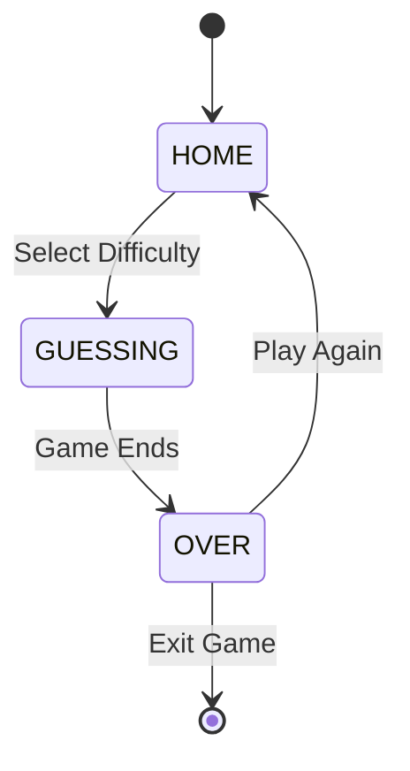

# 🎵 Twenty One Pilots Song Guesser 🎵

<div align="center">
  
  
  
  
  
  *Can you identify Twenty One Pilots songs from just a snippet? Test your knowledge in this interactive guessing game!*
  
  **[Play](#-getting-started) • [Features](#-features) • [Screenshots](#-screenshots) • [Documentation](#-documentation)**
  
</div>

---

## 📖 Table of Contents

- [About](#-about-the-project)
- [Features](#-features)
- [Getting Started](#-getting-started)
- [How to Play](#-how-to-play)
- [Project Structure](#-project-structure)
- [Documentation](#-documentation)
- [Technical Details](#-technical-details)
- [Contributing](#-contributing)
- [Author](#-author)
- [Acknowledgments](#-acknowledgments)

---

## 🎮 About The Project

**Twenty One Pilots Song Guesser** is a console-based Java game that challenges your knowledge of Twenty One Pilots' discography. With 30 carefully selected song snippets, multiple difficulty levels, and an engaging gameplay loop, this game offers both casual fans and die-hard supporters a fun way to test their familiarity with the band's lyrics.

### 🎯 Why This Game?

- 🧠 **Test Your Knowledge** - How well do you really know Twenty One Pilots?
- 🎚️ **Multiple Difficulties** - From casual listener to superfan
- 📊 **Track Your Progress** - Score system to measure your expertise
- 🔄 **Endless Replayability** - Randomized snippets each game

---

## ✨ Features

### 🎚️ **Five Difficulty Levels**
Choose your challenge level based on your confidence:

| Difficulty | Guesses | Description |
|------------|---------|-------------|
| 😌 **Easy** | 10 | Perfect for casual listeners |
| 😊 **Normal** | 7 | The balanced experience |
| 😤 **Hard** | 5 | For dedicated fans |
| 😰 **Extreme** | 3 | Think you know every song? |
| 💀 **Impossible** | 1 | One chance. No mistakes. |

### 🎲 **Dynamic Gameplay**
- **30 unique song snippets** covering the band's discography
- **Randomized order** each playthrough
- **Case-insensitive** answer checking
- **Instant feedback** on your guesses

### 📊 **Progress Tracking**
- Real-time score display
- Remaining guesses counter
- Win/loss statistics
- Total guesses used tracking

---

## 🚀 Getting Started

### Prerequisites

- ☕ **Java 11** or higher
- 💻 Terminal/Command Prompt with ANSI support (for console clearing)
- 📁 All project files in the same directory

### Installation

1. **Clone the repository**
   ```bash
   git clone https://github.com/yourusername/M319-KN07.git
   cd M319-KN07
   ```

2. **Compile the project**
   ```bash
   javac KN07/M319_KN07/*.java
   ```

3. **Run the game**
   ```bash
   java KN07.M319_KN07.Main
   ```

---

## 🎯 How to Play

### 1️⃣ **Select Your Difficulty**
```
Welcome!
Choose a difficulty:
[1] Easy
[2] Normal
[3] Hard
[4] Extreme
[5] Impossible
> 
```

### 2️⃣ **Guess the Song**
```
--- Guess the Twenty One Pilots Song ---
Score: 0 / 30
Guesses: 7
Snippet: Wish we could turn back time, to the good old days.
> 
```

### 3️⃣ **Get Feedback**
- ✅ **Correct!** - Move to the next snippet
- ❌ **Not quite...** - Try again (if guesses remain)

### 4️⃣ **Win Condition**
- 🏆 Get all **30 songs correct** to win!
- 💔 Run out of guesses = Game Over

---

## 📁 Project Structure

```
M319_KN07/
│
├── 📄 Game.java           # Main game logic and state management
├── 📄 GameState.java      # Game state enumeration
├── 📄 GameDifficulty.java # Difficulty level enumeration
├── 📄 Snippet.java        # Song snippet data model
├── 📄 Helper.java         # Utility functions
├── 📄 Main.java           # Entry point
├── 📝 snippets.txt        # Song snippets database
├── 📊 ActivityDiagram.mermaid # Game flow visualization
├── 📖 README.md           # This file
└── 🚫 .gitignore          # Git ignore rules
```

---

## 📚 Documentation

### 🔨 Building Documentation

Generate comprehensive Javadoc documentation:

```bash
# From the M319_KN07 directory
javadoc -d docs -author -version -private *.java

# Open documentation
open docs/index.html  # macOS
xdg-open docs/index.html  # Linux
start docs/index.html  # Windows
```

### 📖 Documentation Features

- ✅ Complete API documentation
- ✅ Method descriptions and parameters
- ✅ Cross-referenced classes
- ✅ Author and version information
- ✅ Usage examples in descriptions

---

## 🔧 Technical Details

### 🏗️ Architecture

The game follows an **MVC-inspired pattern**:

- **Model**: `Snippet`, `GameState`, `GameDifficulty`
- **Controller**: `Game` class with state management
- **View**: Console-based UI with formatted output

### 🔄 Game State Machine



### 💾 Data Management

- **File-based storage**: Snippets loaded from `snippets.txt`
- **In-memory processing**: ArrayList for snippet management
- **Dynamic shuffling**: Collections.shuffle() for randomization

### 🛠️ Technologies Used

- **Java 11+** - Core language
- **Java Collections** - Data structures
- **Scanner** - User input & file reading
- **ANSI Escape Codes** - Console formatting

---

## 🙏 Acknowledgments

- 🎵 **Twenty One Pilots** - For the amazing music and lyrics
- 🏫 **Module 319 Instructors** - For the project requirements and guidance
- 📚 **Java Documentation** - For comprehensive API references
- 💻 **Stack Overflow Community** - For troubleshooting assistance

---

## 📜 License

This project is licensed under the MIT License - see the [LICENSE](LICENSE) file for details.

---

## 🎉 Fun Facts

- 🎵 The game includes **30 different songs** from various albums
- ⏱️ Average game completion time: **5-10 minutes**
- 🏆 Perfect score achievement rate: **< 5%** on Impossible difficulty
- 🔄 Over **1000+ possible snippet orderings** due to randomization

---
